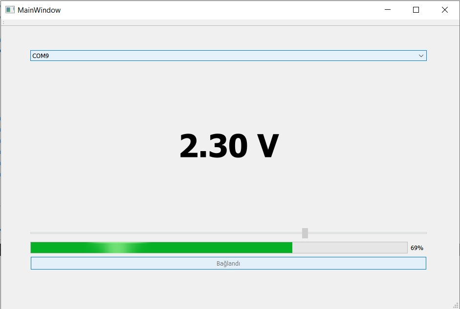
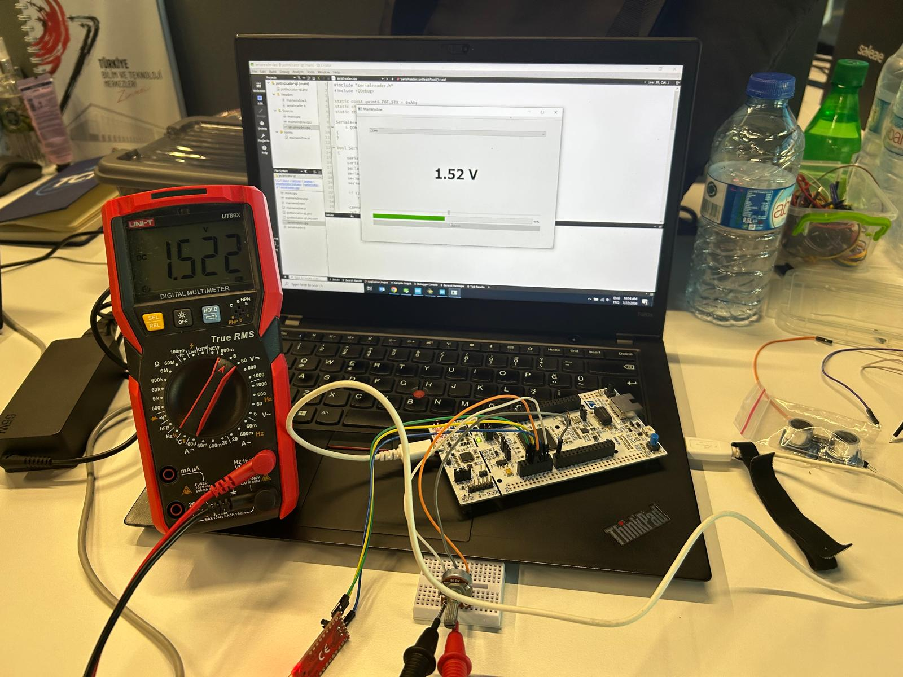

# Potentiometer Indicator — STM32 + Qt

A project that reads a potentiometer via ADC on an STM32 Nucleo-F429ZI board,
transmits the value to a PC over a custom UART framing protocol, and displays
it in real time (voltage, progress bar, and slider) in a Qt Widgets desktop
application.

## How It Works

1. **STM32 (Nucleo-F429ZI):** The potentiometer's wiper is connected to `PA3`
   (ADC1_IN3). The ADC is read continuously in the background via DMA
   (circular mode), without blocking the CPU.
2. **Custom protocol:** The 12-bit ADC reading is packed into a simple framing
   protocol and sent over USART1 (`PA9` TX / `PA10` RX):

   ```
   STX(0xAA) | MSG_ID(0x01) | LEN(0x02) | VALUE_MSB | VALUE_LSB | CHECKSUM | ETX(0x55)
   ```

3. **Qt interface:** A `QSerialPort`-based state machine listens for these
   frames, verifies their integrity with an XOR checksum, converts the raw
   value to voltage (`(value / 4095) × 3.3 V`), and displays it live.

## Features

- 12-bit ADC + DMA for continuous, non-blocking reads
- Custom, checksum-verified communication protocol for fault tolerance
- Real-time Qt interface: progress bar, slider, and voltage label
- Measurement accuracy independently verified with a multimeter

## Hardware

- STM32 Nucleo-F429ZI (STM32F429ZIT6, ARM Cortex-M4)
- Potentiometer (10 kΩ recommended)
- USB-to-UART converter

**Wiring (ST Zio connector, no soldering required):**

| Signal | Pin | Connector |
|---|---|---|
| Potentiometer wiper (data) | PA3 / `A0` | CN9 |
| Potentiometer terminal 1 | +3.3V | CN8 |
| Potentiometer terminal 2 | GND | CN8 |
| UART TX | PA9 | CN10 |
| UART RX | PA10 | CN10 |
| UART GND | GND | CN10 |

## Project Structure

```
├── STM32_Firmware/           # STM32CubeIDE project (CubeMX .ioc + C code)
│   ├── Core/Inc/
│   │   ├── potentiometerIndicator.h
│   │   └── uart_link.h
│   └── Core/Src/
│       ├── potentiometerIndicator.c
│       └── uart_link.c
└── Qt_Interface/             # Qt Widgets desktop application
    ├── mainwindow.h / .cpp / .ui
    ├── serialreader.h / .cpp
    └── main.cpp
```

*(Update the folder names to match your actual repo layout.)*

## Setup and Running

### STM32 side
1. Open the `STM32_Firmware` folder in STM32CubeIDE.
2. Connect the board via USB, build and flash the project.

### Qt side
1. Open the `.pro` file inside `Qt_Interface` in Qt Creator.
2. Build and run.
3. In the app, select the correct COM port and click **Connect**.

## Screenshots

**Qt interface:**



**Hardware setup and multimeter verification:**



The agreement between the multimeter reading (**1.522 V**) and the value
shown in the interface (**1.52 V**) confirms that the ADC reading and
protocol pipeline are working correctly end to end.

## Protocol Details

| Byte | Meaning |
|---|---|
| `0xAA` | STX (start) |
| `0x01` | Message type (potentiometer value) |
| `0x02` | Payload length (2 bytes) |
| 2 bytes | ADC value (MSB, LSB) |
| 1 byte | XOR checksum (MSG_ID ^ LEN ^ payload) |
| `0x55` | ETX (end) |

## Future Improvements

- Support for multiple sensors/channels
- Live chart showing the value over time
- Stronger integrity check (e.g., CRC16)

## License

*(Add a license appropriate for your repo, e.g., MIT.)*
